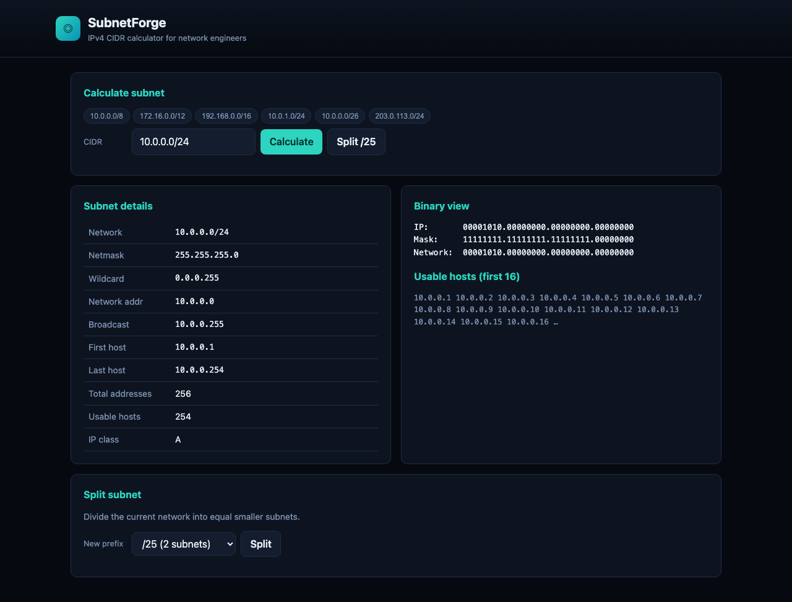

# SubnetForge

**IPv4 CIDR calculator** for network engineers — compute network/broadcast addresses, usable host ranges, wildcard masks, and split subnets on the fly.

No install, no cloud. Paste a CIDR, hit Calculate, and get everything you need for firewall rules, VLAN planning, and IPAM spreadsheets.

## Screenshots

| View | Preview |
|------|---------|
| Calculator |  |
| Split subnet |  |

## What it does

| Feature | Purpose |
|---------|---------|
| **CIDR calculator** | Network, broadcast, first/last host, host count |
| **RFC presets** | Quick-select 10/8, 172.16/12, 192.168/16, and lab ranges |
| **Subnet split** | Divide a block into equal smaller subnets (e.g. /24 → /25) |
| **Copy-friendly output** | Plain values for tickets and change docs |

## Run

No build step. Open via a local web server or double-click `index.html` (fully client-side).

### Linux

```bash
git clone <your-repo-url>
cd SubnetForge
python3 -m http.server 8080
```

Open http://localhost:8080

### Windows

```powershell
git clone <your-repo-url>
cd SubnetForge
python -m http.server 8080
```

Open http://localhost:8080

### macOS

```bash
git clone <your-repo-url>
cd SubnetForge
python3 -m http.server 8080
open http://localhost:8080
```

## Project structure

```
SubnetForge/
├── index.html
├── css/styles.css
├── js/app.js
├── media/
└── README.md
```

## License

MIT
